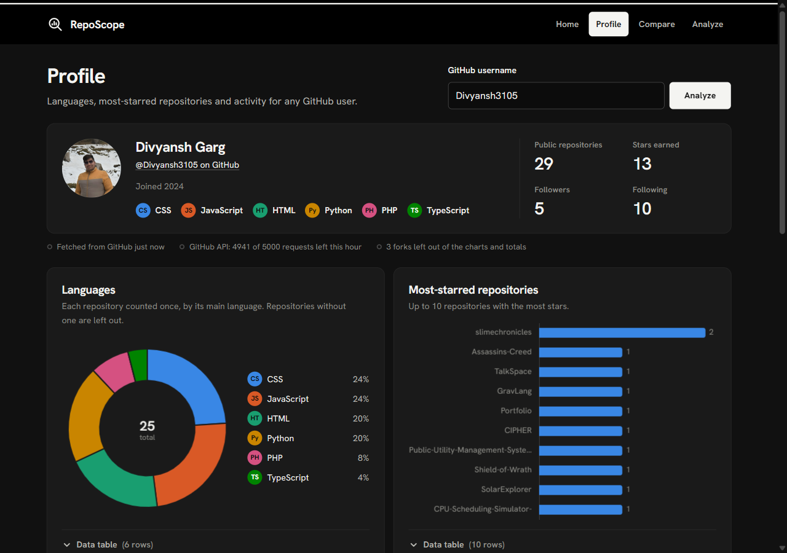
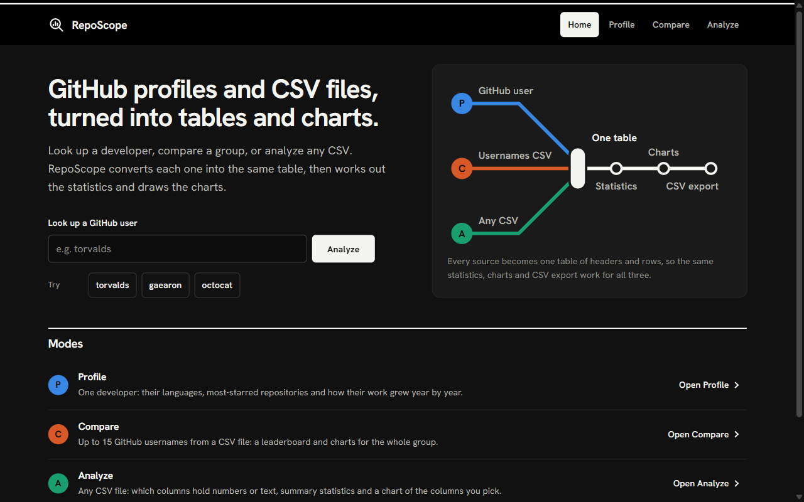
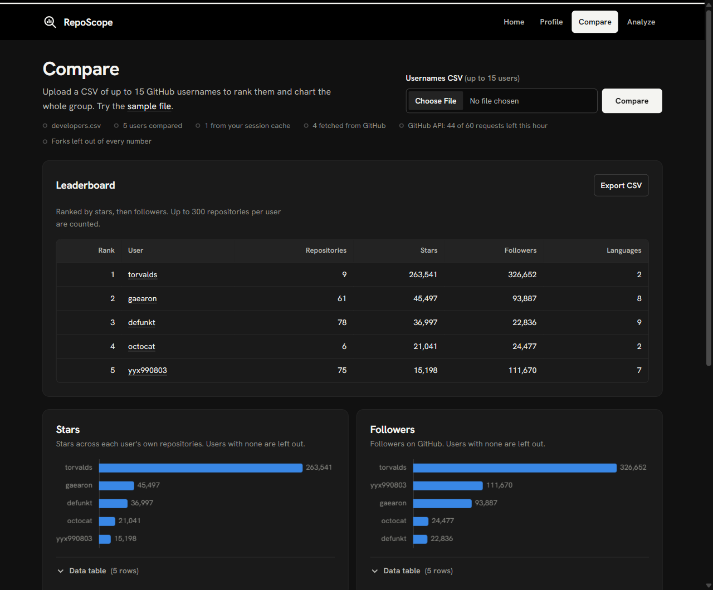
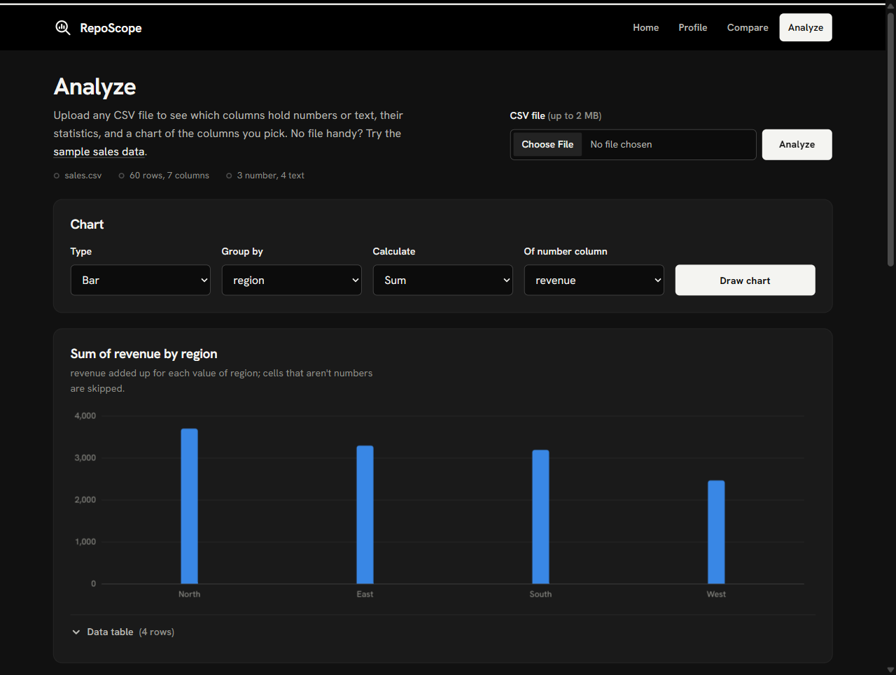

# RepoScope

RepoScope turns GitHub profiles and CSV files into statistics and interactive charts. It is written in plain PHP 8.5 with a canvas chart library built from scratch: no framework, no database and no build step.




**Status:** all four modes are complete (see the [roadmap](#roadmap)).

## Contents

- [Features](#features)
- [Screenshots](#screenshots)
- [Quick start](#quick-start)
- [How it works](#how-it-works)
- [Security](#security)
- [Configuration](#configuration)
- [Project structure](#project-structure)
- [Roadmap](#roadmap)
- [Troubleshooting](#troubleshooting)
- [What I learned](#what-i-learned)
- [Credits and license](#credits-and-license)

## Features

| Mode | Input | Output |
| --- | --- | --- |
| Profile | A GitHub username | Profile summary, language donut, the 10 most-starred repositories, repositories created per year |
| Compare | A CSV of up to 15 usernames ([sample](public/samples/developers.csv)) | Leaderboard by stars and followers, bar charts for stars, followers and repositories, a combined language chart |
| Analyze | Any CSV file ([sample](public/samples/sales.csv)) | Column type detection, number and text statistics, a bar, line or pie chart of any grouping, a data preview |
| Export | Any result table | A CSV download that opens cleanly in Excel and is protected against formula injection |

Other details:

- **Canvas charts:** sharp on high-DPI screens and responsive, with tooltips and an "Other" slice for long pie tails. Every chart has a data table beneath it for screen readers.
- **CSV statistics:** count, sum, min, max, mean and median for number columns. Filled, empty and unique counts and the 10 most common values for text columns. A column counts as numeric when at least 80% of its filled cells are numbers, so a stray `N/A` does not change its type.
- **API quota handling:** GitHub results are cached in the session for 10 minutes. The remaining quota is shown on the Profile and Compare pages, and once the hourly limit is used up the app stops sending requests until it resets.
- **Partial Compare results:** a user who cannot be loaded is listed with the reason, and the rest of the group still loads.
- **No JavaScript required for forms:** every form submits normally, and every chart has an HTML table with the same data.

## Screenshots

| Home | Compare | Analyze |
| --- | --- | --- |
|  |  |  |

## Quick start

With Docker (no local PHP needed), run this from the project folder:

```bash
docker run --rm -p 8000:8000 -v "$(pwd):/app" -w /app php:8.5-cli php -S 0.0.0.0:8000 -t public
```

In Windows PowerShell, use `${PWD}` instead of `$(pwd)`.

With a local PHP 8.5 (the `openssl`, `mbstring` and `fileinfo` extensions must be enabled):

```bash
php -S localhost:8000 -t public
```

Then open <http://localhost:8000>. The `-t public` flag makes `public/` the web root, so `includes/` and `config/` cannot be reached from the browser.

The sample files in [`public/samples/`](public/samples) let you try the app without your own data: `sales.csv` for Analyze and `developers.csv` for Compare.

### GitHub token (optional)

GitHub allows 60 unauthenticated requests per hour per IP address, and 5,000 with a token. Create a [fine-grained personal access token](https://github.com/settings/personal-access-tokens/new) with no extra permissions (RepoScope only reads public data). Then either set the `GITHUB_TOKEN` environment variable or create the git-ignored file `config/config.local.php`:

```php
<?php
return ['github_token' => 'your-token'];
```

## How it works

Every data source is converted into the same table shape, so one set of statistics functions, chart builders and the CSV exporter serves all modes:

```php
[
    'headers' => ['Repository', 'Language', 'Stars'],
    'rows'    => [
        ['repo-a', 'PHP', 120],
        ['repo-b', 'JavaScript', 45],
    ],
]
```

```text
   GitHub REST API                       CSV upload
         |                                   |
   includes/github.php                 includes/csv.php
   fetch, trim, session cache          validate, parse, detect headers
         |                                   |
         +---------------+-------------------+
                         |
              { headers, rows } table
                         |
       +-----------------+------------------+
       |                 |                  |
 includes/stats.php   chart builders     public/export.php
 summary statistics   JSON -> charts.js  CSV download
```

Each request follows the same steps:

1. The page loads `includes/bootstrap.php`, which sets up error handling, security headers and the session.
2. Input is validated: whitelists for options, GitHub's own rules for usernames, and a CSRF token on every POST.
3. Data comes from the session cache or from GitHub and is converted into a table.
4. `session_write_close()` releases the session lock early so other tabs are not blocked.
5. PHP renders the page. Chart data is embedded as JSON and `js/charts.js` draws it.

Uploads use Post/Redirect/Get, so refreshing a result page never re-sends the file.

## Security

| Risk | Mitigation |
| --- | --- |
| Cross-site scripting | All output goes through `e()` (`htmlspecialchars` with `ENT_QUOTES \| ENT_SUBSTITUTE`). A Content Security Policy blocks inline scripts as a second layer. Chart data is encoded with the `JSON_HEX_*` flags so it cannot close its `<script>` tag. |
| Malicious links | URLs from GitHub (avatars, websites) are used only when they start with `http://` or `https://`, so a `javascript:` link is rejected. |
| CSRF | Every POST form carries a 64-character random token, checked with `hash_equals()`. Cookies are `SameSite=Lax`. |
| Session hijacking and fixation | `HttpOnly` and `Secure` cookies (also behind a proxy, through `X-Forwarded-Proto`), strict session mode, and a fresh session ID for every new session. |
| Clickjacking and content sniffing | `frame-ancestors 'none'`, `X-Content-Type-Options: nosniff` and `Referrer-Policy: same-origin`. |
| Hostile uploads | The upload error code, `is_uploaded_file()`, the `.csv` extension, a 2 MB limit and the real MIME type through `fileinfo` are all checked. Files are read from PHP's temp folder and never stored. Parsing stops at 5,000 rows and 50 columns. |
| CSV formula injection | Exported cells starting with `=`, `+`, `-`, `@`, a tab or a carriage return get a leading `'`, so spreadsheets show them as text. Real numbers are left alone. |
| Path tricks in exports | `export.php` serves only tables already stored in the visitor's session, chosen from a fixed list. The download name is built from safe characters only. |
| Token leaks | The GitHub token comes from the environment or a git-ignored file and is sent only to GitHub. It never reaches the browser. |
| Information leaks | Errors are logged, never displayed. Uncaught exceptions show a generic error page. |

## Configuration

All limits are in [`config/config.php`](config/config.php):

| Setting | Default | Meaning |
| --- | --- | --- |
| `CACHE_TTL` | 600 | Seconds a GitHub result stays cached in the session |
| `CACHE_MAX_ENTRIES` | 30 | Users kept in the cache before the oldest is dropped |
| `GITHUB_MAX_PAGES` | 3 | Pages of 100 repositories fetched per user (300 at most) |
| `GITHUB_TIMEOUT` | 10 | Seconds to wait for each GitHub request |
| `COMPARE_MAX_USERS` | 15 | Usernames accepted per Compare upload |
| `UPLOAD_MAX_BYTES` | 2 MB | Largest CSV upload |
| `CSV_MAX_ROWS` / `CSV_MAX_COLS` | 5,000 / 50 | Rows and columns read from a CSV |
| `NUMERIC_THRESHOLD` | 0.8 | Share of filled cells that must be numbers for a column to count as numeric |

## Project structure

```text
RepoScope/
├── public/                  web root (the only folder the browser can reach)
│   ├── index.php            home page
│   ├── profile.php          Profile mode
│   ├── compare.php          Compare mode
│   ├── analyze.php          Analyze mode
│   ├── export.php           CSV download of any result table
│   ├── samples/             sample CSVs for Analyze and Compare
│   ├── og-image.png         1200x630 preview image for link sharing
│   ├── robots.txt           keeps crawlers away from the export endpoint
│   ├── css/style.css        theme and chart colours
│   ├── js/charts.js         canvas charts
│   ├── js/ui.js             form feedback
│   ├── js/vendor/           GSAP 3.15
│   └── fonts/               Hanken Grotesk (self-hosted)
├── includes/
│   ├── bootstrap.php        error handling, security headers, session
│   ├── helpers.php          escaping, validation, CSRF
│   ├── layout.php           page shell, tables, chart panels
│   ├── github.php           GitHub client, cache, Compare leaderboard
│   ├── csv.php              upload checks, parser, safe CSV writer
│   └── stats.php            statistics and chart-data builders
├── config/config.php        limits and the optional token
└── docs/screenshots/        images used in this README
```

## Roadmap

- [x] Security foundations, layout and theme
- [x] GitHub client with session cache, Profile mode, canvas charts
- [x] CSV parsing, statistics, Analyze mode
- [x] Compare mode, CSV export with formula-injection protection

## Troubleshooting

- **"Could not reach GitHub" on Windows:** enable `extension=openssl`, `extension=mbstring` and `extension=fileinfo` in `php.ini`, and set `openssl.cafile` to a CA bundle such as [cacert.pem](https://curl.se/docs/caextract.html).
- **"An Application Control policy has blocked php_openssl.dll":** Windows Smart App Control is blocking the unsigned extension. Run the app with the Docker command above instead.
- **Rate limit reached:** wait for the reset time shown on the page, or add a GitHub token.

## What I learned

- PHP holds the session lock for the whole request, so calling `session_write_close()` early keeps other tabs responsive.
- Security works in layers: escaping and a CSP, CSRF tokens and `SameSite` cookies.
- Behind a reverse proxy such as Render, PHP only sees HTTP. The original scheme arrives in `X-Forwarded-Proto`.
- A canvas has to be scaled by `devicePixelRatio`, and tooltips need their own hit-testing.
- File extensions prove nothing: `fileinfo` checks the bytes, and `is_uploaded_file()` proves the upload is real.
- When a request exceeds `post_max_size`, PHP silently empties `$_POST` and `$_FILES`.
- Excel writes "CSV" as Windows-1252 and reads UTF-8 only when the file starts with a byte order mark.
- Only correctly grouped commas are thousands separators: `1,234` is a number, `1,23` is not.
- Exported CSVs can carry formulas, so cells starting with `=`, `+`, `-` or `@` need defusing.

## Credits and license

Released under the [MIT License](LICENSE). Copyright 2026 Divyansh Garg.

- [GSAP](https://gsap.com) by GreenSock (`public/js/vendor/gsap.min.js`), included unchanged under its [Standard "No Charge" License](https://gsap.com/standard-license).
- [Hanken Grotesk](https://fonts.google.com/specimen/Hanken+Grotesk) under the SIL Open Font License ([OFL.txt](public/fonts/OFL.txt)).
- Interface guidance from [Impeccable](https://impeccable.style), [transitions.dev](https://transitions.dev) and [make-interfaces-feel-better](https://github.com/jakubkrehel/make-interfaces-feel-better).
